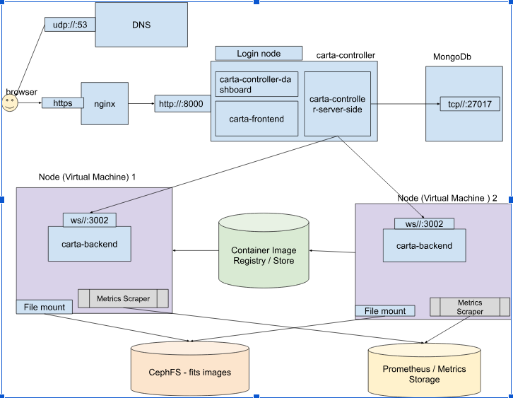

# CARTA Controller

The CARTA controller provides a simple dashboard that authenticates users and allows them to manage their CARTA backend processes. It also serves static frontend code to clients and dynamically redirects authenticated client connections to the appropriate backend processes. The controller can either handle authentication itself or delegate it to an external OAuth2-based authentication server.

For installation and configuration instructions, as well as more detailed information about the controller’s features, please consult [the full documentation on ReadTheDocs](https://carta-controller.readthedocs.io/en/dev/).

If you encounter a problem with the controller or its documentation, please submit an issue in the controller repository. If you need assistance with configuration or deployment, please contact the [CARTA helpdesk](mailto:support@carta.freshdesk.com).

Although the links above point to the main CARTA Controller project, this repository focuses specifically on the deployment of CARTA in two different environments:

- [Kubernetes deployment](https://github.com/Jotham12/carta-deployment-comparison/tree/main/Kubernetes-deployment)
- [HPC deployment using Slurm](https://github.com/Jotham12/carta-deployment-comparison/tree/main/hpc-deployment)

To reflect this, the repository is organised into two main folders, `Kubernetes-deployment` and `hpc-deployment`. Each folder contains its own dedicated `README.md` file describing the scripts, configuration files, and step-by-step deployment process for that environment.

## Architectural Diagram

The diagram below presents the main components of the CARTA deployment architecture and how they interact across the user interface, controller layer, compute layer, and storage/services layer.

At the entry point, user traffic begins in the browser and is routed over HTTPS through NGINX. DNS supports service discovery, while NGINX forwards requests to the CARTA controller running on the login node. The controller itself is divided into multiple logical components, including the dashboard, the frontend, and the server-side controller logic.

The login node acts as the central coordination point of the system. It handles user-facing access, authentication, and backend orchestration. The controller also communicates with MongoDB, which stores persistent state information required by the platform.

The compute layer is represented by separate virtual machines hosting CARTA backend instances. These backend services communicate with clients over WebSocket connections and are launched independently from the controller layer. This separation makes it possible to keep the user-facing control plane distinct from the backend execution environment.

Shared services are shown in the lower section of the diagram. CephFS provides shared access to FITS image data across nodes through file mounts, ensuring that both backend instances can access the same dataset. A container image registry or store supplies the runtime images required for backend deployment. Prometheus and the metrics storage layer support monitoring, while metrics scrapers on the compute nodes collect operational information from the running services.

Overall, the diagram highlights the main architectural idea behind the deployment: the CARTA controller remains centralized on the login node, backend computation is distributed across worker or compute nodes, and shared storage plus monitoring services support the whole environment.
